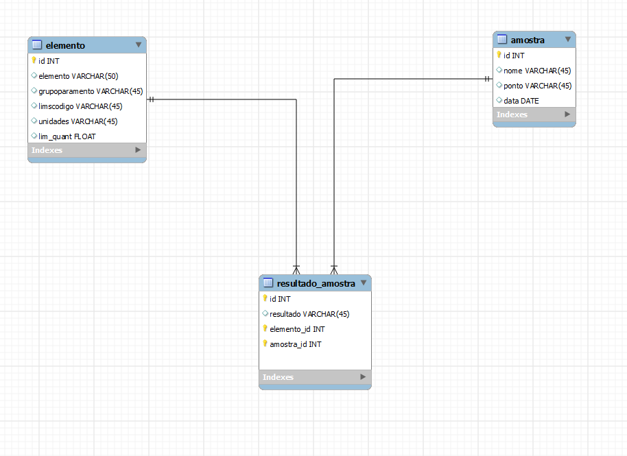
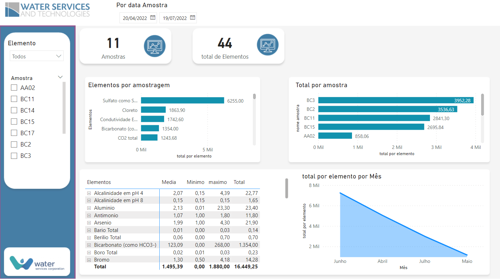
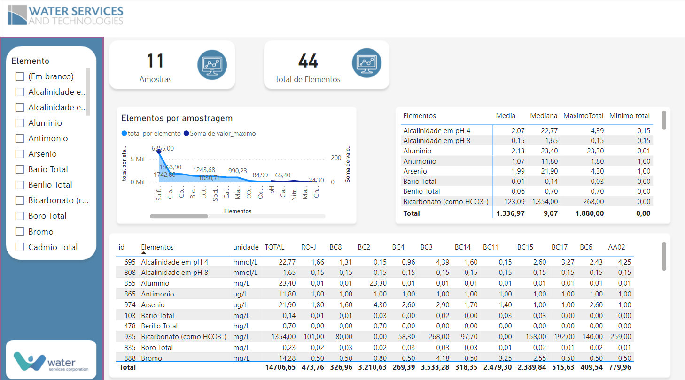

<h1 align="center">
 
  
 
 
 Dashbord em Power BI

</h1>

Origem de dados foi teste de uma vagar com Analista BI,dados entregue e formato excel.
Apresente um documento em Word ou PDF explicando sucintamente o raciocínio utilizado para transformar a tabela bem como possíveis inconsistências encontradas. Apresente também a tabela obtida na transformação e os códigos desenvolvidos caso utilize Python e/ou R 
<ul>
<li>Gráfico de série histórica de concentração dos parâmetros</li>
<li>Tabela contendo a média, mediana e valores máximo e mínimo para cada parâmetro;</li>
<li>Indicadores e filtros que julgar adequados. </li>
<li>Design e usabilidade do relatório (posicionamento de botões, textos, filtros e visuais de modo a facilitar a análise dos dados); </li>
</ul>

  

  

    

    

    

    

## Tecnologia usada

Usado do modelo de framework, no servidor linux e windows

- ⚛️ **DAX** — Dax 
- ⚛️ **POWER BI ** — Criação de Dash bord em Power BI
- 💹 **JQuery** — para cadastro de imagens
- 📄 **R** — para Excell

## Modelos

1. Modelo realizado dados não reais
2. Todos os direito autoras pela david orion 
3. Modelo apenas ilustratorio 

### Equipe de desenvolvimento

1. David orion (Analista de sistemas)

